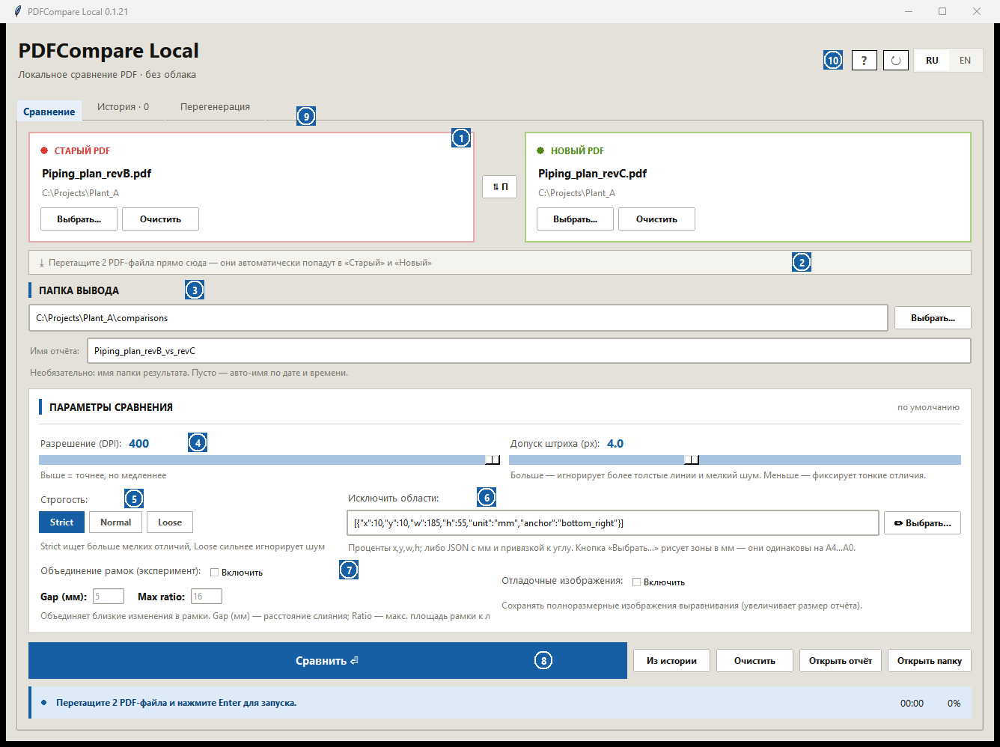

# PDFCompare Local

> Локальное сравнение двух ревизий PDF (чертежи, схемы, спецификации) с наглядным HTML-отчётом. Windows, без облака — файлы не покидают ваш компьютер.

Current release: `v0.1.13`

[![Download Installer][download-setup-badge]][download-setup]
[![Download Windows EXE][download-exe-badge]][download-exe]
[![Download portable ZIP][download-zip-badge]][download-zip]
[![Latest Release][latest-release-badge]][latest-release]

[![Add to Cursor][cursor-badge]][cursor-install]
[![Install in VS Code][vscode-badge]][vscode-install]

## Возможности

- **Визуальный HTML-отчёт** — матрица изменений по всем листам, постраничный просмотр OLD / NEW / DIFF и слайдер-сравнение со шторкой.
- **Метрики для чертежей** — процент изменений от нарисованного контента (FG %), площадь изменений в мм², число зон; классификация «мелкие / средние / крупные».
- **Сопоставление листов** между ревизиями: добавленные, удалённые и изменённые листы находятся даже при сдвиге нумерации.
- **Исключаемые зоны** — штампы, рамки и подписи можно вырезать из сравнения: визуальным редактором (мм-сетка, форматы A4–A0, привязка к углам) или текстом в поле.
- **Перегенерация** — пересчёт отдельных листов с другим DPI / строгостью без полного повторного прогона.
- **MCP-сервер для AI-агентов** (Cursor, Claude Code, VS Code) — те же операции через инструменты агента.
- **Автообновление** — приложение само находит новый релиз, скачивает инсталлятор и обновляется.

## Установка

| Вариант | Кому подходит |
|---|---|
| **[Инсталлятор][download-setup]** — рекомендуется | Ставится в профиль пользователя (без прав администратора), создаёт ярлыки, удаляется штатно, обновляется в один клик из самого приложения |
| [Portable EXE][download-exe] | Один файл без установки; для обновления скачайте новый EXE |
| [Portable ZIP][download-zip] + Python 3.12 | Запуск из исходников: `scripts/setup.ps1`, затем `scripts/run.ps1` |

Python для инсталлятора и EXE не нужен.

## Быстрый старт

1. Перетащите два PDF прямо в окно (или выберите кнопками): старая ревизия — слева, новая — справа.
2. Если на листах есть штамп или рамка, которые не нужно сравнивать, — «Исключить области» → «Выбрать…» и обведите зону на превью.
3. Нажмите «Сравнить» (или Enter) и откройте готовый HTML-отчёт.

## Интерфейс



| № | Зона | Что делает |
|---|---|---|
| 1 | Карточки файлов | Старая и новая ревизии PDF; кнопка между карточками меняет их местами |
| 2 | Зона перетаскивания | Бросьте два PDF сразу — они автоматически разложатся в «Старый» и «Новый» |
| 3 | Папка вывода и имя отчёта | Куда сложить результат; пустое имя — авто-имя по дате и времени |
| 4 | Точность | DPI рендера (выше — точнее, но медленнее) и допуск штриха в px (гасит шум тонких линий и сглаживания) |
| 5 | Строгость | `strict` ловит больше мелких отличий, `loose` игнорирует мелкий дребезг, `normal` — баланс |
| 6 | Исключаемые зоны | Текстовое поле + кнопка визуального редактора зон (см. раздел ниже) |
| 7 | Эксперименты | Объединение соседних рамок изменений (gap в мм) и сохранение отладочных изображений |
| 8 | Запуск и действия | «Сравнить», подстановка из истории, открытие отчёта/папки; ниже — статус, таймер и прогресс |
| 9 | Вкладки | «История» запусков и «Перегенерация» отдельных листов с новыми настройками |
| 10 | Язык и обновления | Переключатель RU/EN и ручная проверка обновлений (↻) |

## Исключаемые зоны (штампы, рамки, подписи)

### Визуальный редактор

Кнопка «Выбрать…» открывает превью листа:

- миллиметровая сетка с шагом 5–50 мм и автоопределение формата листа (A4–A0, с ручным переопределением для сканов);
- рисование зоны рамкой с живой подписью размера в мм; готовые зоны можно двигать, растягивать за 8 маркеров и удалять (Del);
- у каждой зоны есть **якорь** ↖/↗/↙/↘ — отступы считаются от выбранного угла листа. Зона штампа с якорем ↘ (низ-право) остаётся на месте и на A4, и на A0;
- существующие значения поля открываются как редактируемые рамки; для многостраничных PDF есть переключатель страницы.

### Текстом в поле

| Формат | Пример | Когда удобно |
|---|---|---|
| Проценты `x,y,w,h` через `;` | `70,80,30,20` | Быстрая зона от верхнего-левого угла |
| JSON: мм + якорь | `[{"x":10,"y":10,"w":185,"h":55,"unit":"mm","anchor":"bottom_right"}]` | Штамп 185×55 мм в 10 мм от правого-нижнего угла — работает на любом формате листа |
| JSON: проценты | `[{"x":0,"y":90,"w":100,"h":10}]` | Нижняя полоса на всю ширину |

`unit`: `percent` (по умолчанию) / `mm` / `px`. `anchor`: `top_left` (по умолчанию) / `top_right` / `bottom_left` / `bottom_right`. Те же форматы принимают CLI (`--exclude-region`) и MCP-инструменты.

## Отчёт

<p>
  
  
  
</p>

- **Матрица изменений** — все листы с бейджами статуса и метрикой FG % (доля изменённого от нарисованного контента).
- **Просмотр листа** — OLD / NEW / DIFF с подсветкой зон изменений.
- **Слайдер** — шторка OLD↔NEW с пришпиленной панелью навигации по листам, масштабированием и настройкой рамок изменений.

Скриншоты показывают интерфейс; содержимое чертежей может быть размыто.

## Обновления

Приложение раз в час проверяет GitHub Releases. Когда выходит новая версия, установленное через инсталлятор приложение предлагает «Скачать и установить сейчас» — скачивает инсталлятор, тихо обновляется и перезапускается само. Portable EXE открывает страницу загрузки. Кнопка ↻ в шапке — проверить вручную.

## CLI

```powershell
python compare_pdfs.py --old old.pdf --new new.pdf --out-dir runs --run-name My_Comparison
python compare_pdfs.py --old old.pdf --new new.pdf --exclude-region "70,80,30,20" --diff-strictness loose
python compare_pdfs.py --old old.pdf --new new.pdf --bbox-merge-gap-mm 5 --keep-debug-images
```

Основные флаги: `--dpi`, `--stroke-tol`, `--diff-strictness` (`strict`/`normal`/`loose`), `--exclude-region` (повторяемый, проценты `X,Y,W,H` или JSON), `--bbox-merge-gap-mm` / `--bbox-merge-max-area-ratio` (эксперимент), `--keep-debug-images`, `--workers`, `--lang`, `--run-name`.

## AI Agent Setup (MCP)

Вставьте в вашего локального агента:

```text
Прочитай https://raw.githubusercontent.com/mikhalchankasm/AutoPDFCompare/master/docs/SETUP_PROMPT.md и выполни инструкцию по подключению PDFCompare MCP. Используй stdio transport, имя сервера pdfcompare.
```

Обновление позже:

```text
Обнови PDFCompare MCP по инструкции из https://raw.githubusercontent.com/mikhalchankasm/AutoPDFCompare/master/docs/SETUP_PROMPT.md
```

Важно: MCP-кнопки запускают локальную PowerShell-команду и код из этого репозитория. Используйте их, только если доверяете репозиторию и агенту.

Агенту доступны те же операции, что и в GUI: подготовка и запуск сравнения, статус/отмена, перегенерация листов, список прошлых прогонов и визуальный выбор исключаемых зон (`pick_pdf_exclude_region`). Подробности: [docs/LOCAL_AGENT_MCP.md](docs/LOCAL_AGENT_MCP.md).

## Документация

- MCP: установка и инструменты — [docs/LOCAL_AGENT_MCP.md](docs/LOCAL_AGENT_MCP.md)
- Готовые промпты для агентов — [docs/AGENT_PROMPTS.md](docs/AGENT_PROMPTS.md)
- Skill-гайд для агентов — [docs/PDFCOMPARE_AGENT_SKILL.md](docs/PDFCOMPARE_AGENT_SKILL.md)
- История изменений — [CHANGELOG.md](CHANGELOG.md)
- Процесс релиза — [docs/RELEASE_PROCESS.md](docs/RELEASE_PROCESS.md)
- Промпт для ревью репозитория — [docs/REVIEW_PROMPT.md](docs/REVIEW_PROMPT.md)

## License

No license is declared yet.

[download-setup]: https://github.com/mikhalchankasm/AutoPDFCompare/releases/latest/download/PDFCompareLocal-setup.exe
[download-exe]: https://github.com/mikhalchankasm/AutoPDFCompare/releases/latest/download/PDFCompareLocal.exe
[download-zip]: https://github.com/mikhalchankasm/AutoPDFCompare/releases/latest/download/PDFCompareLocal-portable.zip
[latest-release]: https://github.com/mikhalchankasm/AutoPDFCompare/releases/latest
[download-setup-badge]: https://img.shields.io/badge/Download-Installer-2ea44f?logo=windows&logoColor=white
[download-exe-badge]: https://img.shields.io/badge/Download-Windows_EXE-6e7681?logo=windows&logoColor=white
[download-zip-badge]: https://img.shields.io/badge/Download-Portable_ZIP-0969da?logo=github&logoColor=white
[latest-release-badge]: https://img.shields.io/github/v/release/mikhalchankasm/AutoPDFCompare?label=Latest%20Release
[cursor-badge]: https://cursor.com/deeplink/mcp-install-dark.svg
[cursor-install]: https://cursor.com/install-mcp?name=pdfcompare&config=eyJjb21tYW5kIjoicG93ZXJzaGVsbCIsImFyZ3MiOlsiLU5vUHJvZmlsZSIsIi1FeGVjdXRpb25Qb2xpY3kiLCJCeXBhc3MiLCItQ29tbWFuZCIsIiRFcnJvckFjdGlvblByZWZlcmVuY2U9J1N0b3AnOyAkcmVwbz1Kb2luLVBhdGggJGVudjpMT0NBTEFQUERBVEEgJ1BERkNvbXBhcmVNQ1BcXEF1dG9QREZDb21wYXJlJzsgJGxvZz1Kb2luLVBhdGggJGVudjpURU1QICdwZGZjb21wYXJlX21jcF9ib290c3RyYXAubG9nJzsgaWYgKCEoVGVzdC1QYXRoICRyZXBvKSkgeyBOZXctSXRlbSAtSXRlbVR5cGUgRGlyZWN0b3J5IC1Gb3JjZSAtUGF0aCAoU3BsaXQtUGF0aCAkcmVwbykgKj4gJGxvZzsgZ2l0IGNsb25lIGh0dHBzOi8vZ2l0aHViLmNvbS9taWtoYWxjaGFua2FzbS9BdXRvUERGQ29tcGFyZS5naXQgJHJlcG8gKj4+ICRsb2cgfTsgJiAoSm9pbi1QYXRoICRyZXBvICdzY3JpcHRzXFxydW5fbWNwX2Jvb3RzdHJhcC5wczEnKSJdfQ==
[vscode-badge]: https://img.shields.io/badge/VS_Code-Install_MCP-007ACC?logo=visualstudiocode&logoColor=white
[vscode-install]: https://insiders.vscode.dev/redirect/mcp/install?name=pdfcompare&config=%7B%22name%22%3A%22pdfcompare%22%2C%22command%22%3A%22powershell%22%2C%22args%22%3A%5B%22-NoProfile%22%2C%22-ExecutionPolicy%22%2C%22Bypass%22%2C%22-Command%22%2C%22%24ErrorActionPreference%3D%27Stop%27%3B%20%24repo%3DJoin-Path%20%24env%3ALOCALAPPDATA%20%27PDFCompareMCP%5C%5CAutoPDFCompare%27%3B%20%24log%3DJoin-Path%20%24env%3ATEMP%20%27pdfcompare_mcp_bootstrap.log%27%3B%20if%20%28%21%28Test-Path%20%24repo%29%29%20%7B%20New-Item%20-ItemType%20Directory%20-Force%20-Path%20%28Split-Path%20%24repo%29%20%2A%3E%20%24log%3B%20git%20clone%20https%3A//github.com/mikhalchankasm/AutoPDFCompare.git%20%24repo%20%2A%3E%3E%20%24log%20%7D%3B%20%26%20%28Join-Path%20%24repo%20%27scripts%5C%5Crun_mcp_bootstrap.ps1%27%29%22%5D%7D
