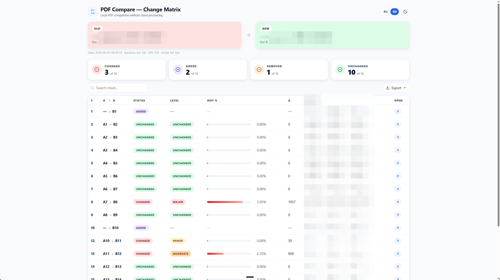
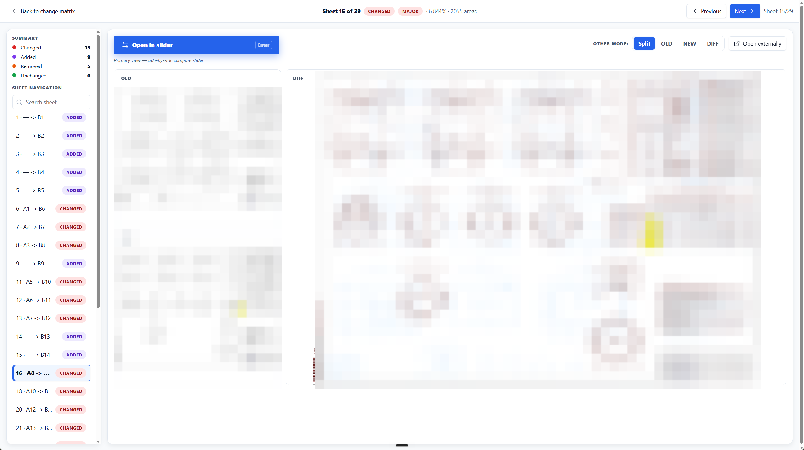
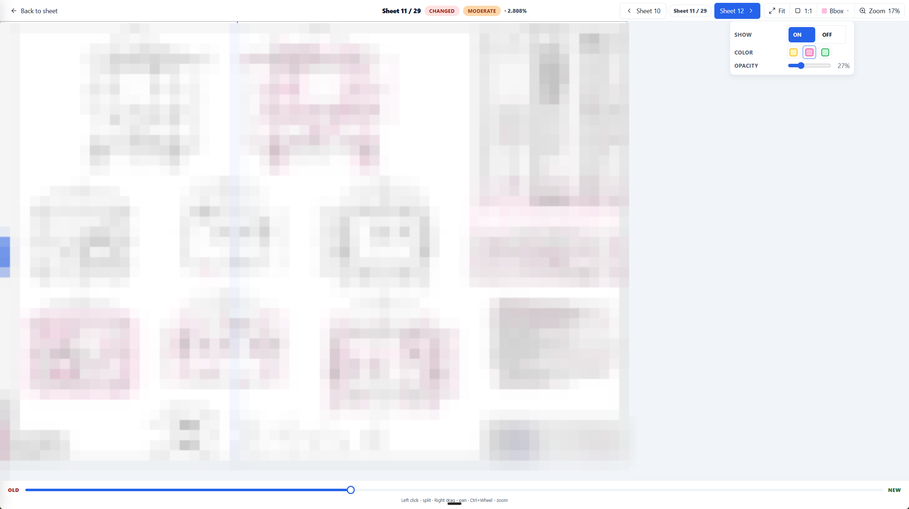

# PDFCompare Local

> Local Windows tool for comparing two PDF revisions and opening a visual HTML diff report.

Current release: `v0.1.13`

[![Download Windows EXE][download-exe-badge]][download-exe]
[![Download portable ZIP][download-zip-badge]][download-zip]
[![Latest Release][latest-release-badge]][latest-release]

[![Add to Cursor][cursor-badge]][cursor-install]
[![Install in VS Code][vscode-badge]][vscode-install]

## AI Agent Setup

Paste this into your local agent:

```text
Прочитай https://raw.githubusercontent.com/mikhalchankasm/AutoPDFCompare/master/docs/SETUP_PROMPT.md и выполни инструкцию по подключению PDFCompare MCP. Используй stdio transport, имя сервера pdfcompare.
```

Update later:

```text
Обнови PDFCompare MCP по инструкции из https://raw.githubusercontent.com/mikhalchankasm/AutoPDFCompare/master/docs/SETUP_PROMPT.md
```

Важно: MCP-кнопки запускают локальную PowerShell-команду и код из этого репозитория. Используйте их только если доверяете репозиторию и агенту.

## Desktop Use

Download `PDFCompareLocal.exe`, select OLD and NEW PDFs, then open the generated HTML report. Python is not required for the EXE.

The GUI exposes the same controls as the MCP server: DPI, stroke tolerance, strictness presets (`strict`/`normal`/`loose`), exclusion regions (manual `x,y,w,h` or a visual picker), experimental bbox merge, and a debug-images toggle. The **Re-render** tab recalculates selected pages with different precision, with both uniform and per-page (mixed) override modes, and shows the `Diff %`, `FG %`, and `mm²` metrics per row.

The app checks for new releases automatically (once per day on launch) and shows a dialog with a download link when an update is available. Click the gear icon in the top-right to check manually.

## Screenshots

Скриншоты показывают интерфейс; содержимое чертежей и спецификаций может быть размыто.

<p>
  
  
  
</p>

## CLI

```powershell
python compare_pdfs.py --old old.pdf --new new.pdf --out-dir runs --run-name My_Comparison
python compare_pdfs.py --old old.pdf --new new.pdf --exclude-region "70,80,30,20" --diff-strictness loose
python compare_pdfs.py --old old.pdf --new new.pdf --bbox-merge-gap-mm 5 --keep-debug-images
```

Notable flags: `--dpi`, `--stroke-tol`, `--diff-strictness` (`strict`/`normal`/`loose`), `--exclude-region` (repeatable `X,Y,W,H` percent), `--bbox-merge-gap-mm` / `--bbox-merge-max-area-ratio` (experimental), `--keep-debug-images`, `--workers`, `--lang`, `--run-name`.

## Docs

- MCP setup and tools: [docs/LOCAL_AGENT_MCP.md](docs/LOCAL_AGENT_MCP.md)
- Copy-paste agent prompts: [docs/AGENT_PROMPTS.md](docs/AGENT_PROMPTS.md)
- Agent skill guide: [docs/PDFCOMPARE_AGENT_SKILL.md](docs/PDFCOMPARE_AGENT_SKILL.md)
- Changelog: [CHANGELOG.md](CHANGELOG.md)
- Release process: [docs/RELEASE_PROCESS.md](docs/RELEASE_PROCESS.md)

## License

No license is declared yet.

[download-exe]: https://github.com/mikhalchankasm/AutoPDFCompare/releases/latest/download/PDFCompareLocal.exe
[download-zip]: https://github.com/mikhalchankasm/AutoPDFCompare/releases/latest/download/PDFCompareLocal-portable.zip
[latest-release]: https://github.com/mikhalchankasm/AutoPDFCompare/releases/latest
[download-exe-badge]: https://img.shields.io/badge/Download-Windows_EXE-2ea44f?logo=windows&logoColor=white
[download-zip-badge]: https://img.shields.io/badge/Download-Portable_ZIP-0969da?logo=github&logoColor=white
[latest-release-badge]: https://img.shields.io/github/v/release/mikhalchankasm/AutoPDFCompare?label=Latest%20Release
[cursor-badge]: https://cursor.com/deeplink/mcp-install-dark.svg
[cursor-install]: https://cursor.com/install-mcp?name=pdfcompare&config=eyJjb21tYW5kIjoicG93ZXJzaGVsbCIsImFyZ3MiOlsiLU5vUHJvZmlsZSIsIi1FeGVjdXRpb25Qb2xpY3kiLCJCeXBhc3MiLCItQ29tbWFuZCIsIiRFcnJvckFjdGlvblByZWZlcmVuY2U9J1N0b3AnOyAkcmVwbz1Kb2luLVBhdGggJGVudjpMT0NBTEFQUERBVEEgJ1BERkNvbXBhcmVNQ1BcXEF1dG9QREZDb21wYXJlJzsgJGxvZz1Kb2luLVBhdGggJGVudjpURU1QICdwZGZjb21wYXJlX21jcF9ib290c3RyYXAubG9nJzsgaWYgKCEoVGVzdC1QYXRoICRyZXBvKSkgeyBOZXctSXRlbSAtSXRlbVR5cGUgRGlyZWN0b3J5IC1Gb3JjZSAtUGF0aCAoU3BsaXQtUGF0aCAkcmVwbykgKj4gJGxvZzsgZ2l0IGNsb25lIGh0dHBzOi8vZ2l0aHViLmNvbS9taWtoYWxjaGFua2FzbS9BdXRvUERGQ29tcGFyZS5naXQgJHJlcG8gKj4+ICRsb2cgfTsgJiAoSm9pbi1QYXRoICRyZXBvICdzY3JpcHRzXFxydW5fbWNwX2Jvb3RzdHJhcC5wczEnKSJdfQ==
[vscode-badge]: https://img.shields.io/badge/VS_Code-Install_MCP-007ACC?logo=visualstudiocode&logoColor=white
[vscode-install]: https://insiders.vscode.dev/redirect/mcp/install?name=pdfcompare&config=%7B%22name%22%3A%22pdfcompare%22%2C%22command%22%3A%22powershell%22%2C%22args%22%3A%5B%22-NoProfile%22%2C%22-ExecutionPolicy%22%2C%22Bypass%22%2C%22-Command%22%2C%22%24ErrorActionPreference%3D%27Stop%27%3B%20%24repo%3DJoin-Path%20%24env%3ALOCALAPPDATA%20%27PDFCompareMCP%5C%5CAutoPDFCompare%27%3B%20%24log%3DJoin-Path%20%24env%3ATEMP%20%27pdfcompare_mcp_bootstrap.log%27%3B%20if%20%28%21%28Test-Path%20%24repo%29%29%20%7B%20New-Item%20-ItemType%20Directory%20-Force%20-Path%20%28Split-Path%20%24repo%29%20%2A%3E%20%24log%3B%20git%20clone%20https%3A//github.com/mikhalchankasm/AutoPDFCompare.git%20%24repo%20%2A%3E%3E%20%24log%20%7D%3B%20%26%20%28Join-Path%20%24repo%20%27scripts%5C%5Crun_mcp_bootstrap.ps1%27%29%22%5D%7D
