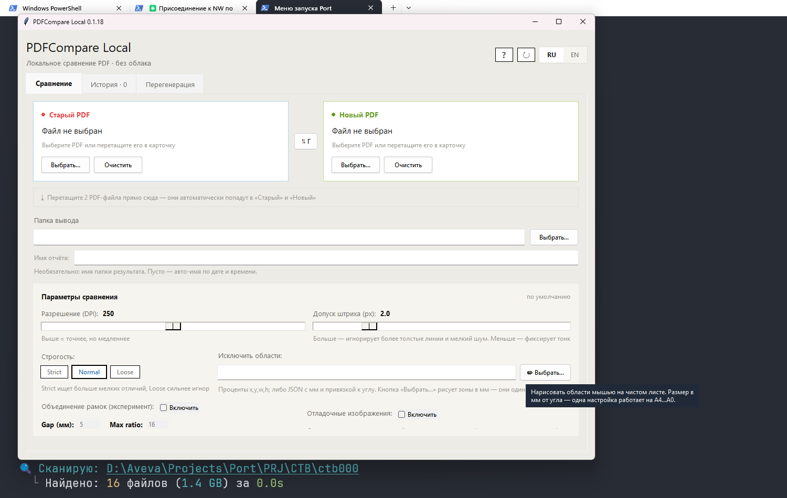
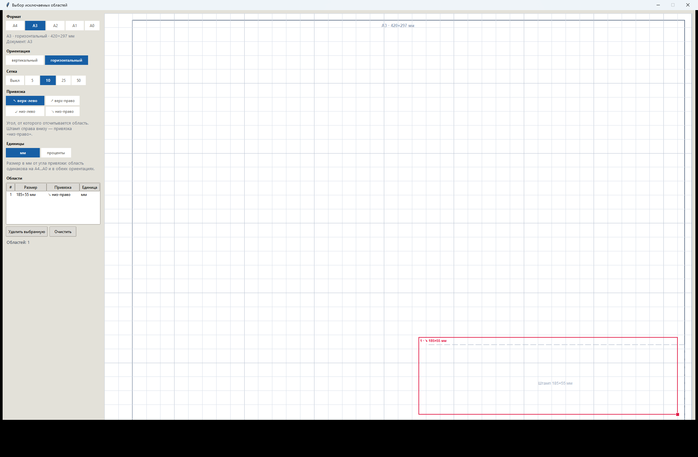

# PDFCompare Local

> Локальное сравнение двух ревизий PDF (чертежи, схемы, спецификации) с наглядным HTML-отчётом. Windows. Основной движок работает без облака; внешняя AI-интерпретация включается отдельно и только после подтверждения.

Current release: `v0.1.31`

[![Download Installer][download-setup-badge]][download-setup]
[![Download Windows EXE][download-exe-badge]][download-exe]
[![Download portable ZIP][download-zip-badge]][download-zip]
[![Latest Release][latest-release-badge]][latest-release]

[![Add to Cursor][cursor-badge]][cursor-install]
[![Install in VS Code][vscode-badge]][vscode-install]

## Возможности

- **Визуальный HTML-отчёт** — матрица изменений по всем листам, постраничный просмотр OLD / NEW / DIFF и слайдер-сравнение со шторкой.
- **Метрики для чертежей** — процент изменений от нарисованного контента (FG %), площадь изменений в мм², число зон; классификация «мелкие / средние / крупные».
- **Сопоставление листов** между ревизиями: добавленные, удалённые и изменённые листы находятся даже при сдвиге нумерации.
- **Автосовмещение смещённых чертежей** — многоступенчатое выравнивание компенсирует перенос, небольшой поворот и изменение масштаба листа до расчёта diff, поэтому повторная публикация без реальных правок не выглядит как изменение всего чертежа.
- **Исключаемые зоны** — штампы, рамки и подписи можно вырезать из сравнения: визуальным редактором (мм-сетка, форматы A4–A0 в обеих ориентациях, привязка к углам) или текстом в поле. Зоны задаются в миллиметрах от угла листа, поэтому одна настройка штампа работает на всех форматах.
- **Перегенерация** — пересчёт отдельных листов с другим DPI / строгостью без полного повторного прогона.
- **MCP-сервер для AI-агентов** (Cursor, Claude Code, VS Code) — те же операции через инструменты агента, плюс опциональное описание реальных diff-зон через личный ключ Gemini/OpenRouter, DeepSeek или Qwen.
- **Автообновление** — приложение само находит новый релиз, скачивает инсталлятор и обновляется.

## Установка

| Вариант | Кому подходит |
|---|---|
| **[Инсталлятор][download-setup]** — рекомендуется | Ставится в профиль пользователя (без прав администратора), создаёт ярлыки, удаляется штатно, обновляется в один клик из самого приложения |
| [Portable EXE][download-exe] | Один файл без установки; для обновления скачайте новый EXE |
| [Portable ZIP][download-zip] + Python 3.12 | Запуск из исходников: `scripts/setup.ps1`, затем `scripts/run.ps1` |

Python для инсталлятора и EXE не нужен.

## Быстрый старт

1. Перетащите два PDF прямо в окно (или выберите кнопками): старая ревизия — слева, новая — справа.
2. Если на листах есть штамп или рамка, которые не нужно сравнивать, — «Исключить области» → «Выбрать…» и обведите зону на превью.
3. Нажмите «Сравнить» (или Enter) и откройте готовый HTML-отчёт.

Не уверены, с чего начать — кнопка **«?»** в шапке (или **F1**) открывает краткую справку: что делать по шагам и что значат цифры в отчёте. У всех параметров есть подсказки при наведении.

## Интерфейс


| № | Зона | Что делает |
|---|---|---|
| 1 | Карточки файлов | Старая и новая ревизии PDF; кнопка между карточками меняет их местами |
| 2 | Зона перетаскивания | Бросьте два PDF сразу — они автоматически разложатся в «Старый» и «Новый» |
| 3 | Папка отчёта | Путь папки, которую создаст запуск. «Сгенерировать имя» соберёт имя из имён обоих PDF (общая часть + ревизии); если указать существующую папку, имя внутри неё подберётся само |
| 4 | Точность | DPI рендера (выше — точнее, но медленнее) и допуск штриха в px (гасит шум тонких линий и сглаживания) |
| 5 | Строгость | `strict` ловит больше мелких отличий, `loose` игнорирует мелкий дребезг, `normal` — баланс |
| 6 | Исключаемые зоны | Текстовое поле + кнопка визуального редактора зон (см. раздел ниже) |
| 7 | Дополнительные режимы | Объединение соседних рамок, сохранение отладочных изображений и фильтр различий толщины линий |
| 8 | Запуск и действия | «Сравнить», подстановка из истории, открытие отчёта/папки; ниже — статус, таймер и прогресс |
| 9 | Вкладки | «История» запусков и «Перегенерация» отдельных листов с новыми настройками |
| 10 | Язык, справка и обновления | Переключатель RU/EN, «?» (справка, F1) и ручная проверка обновлений (↻) |

Наведите курсор на любой параметр — всплывёт подсказка, что он делает:



Режим **«Игнорировать различия толщины линий»** предназначен для CAD-PDF, где после повторного экспорта геометрия не изменилась, но штрихи стали толще или тоньше. Он сопоставляет оси штрихов и подавляет только изменение ширины на прежнем месте; новые и смещённые линии по-прежнему считаются изменениями. Режим выключен по умолчанию, поскольку изменение веса линии иногда бывает намеренным.

## Исключаемые зоны (штампы, рамки, подписи)

### Визуальный редактор



Кнопка «Выбрать…» открывает окно с листом и вертикальной панелью настроек — формат, ориентация, сетка, привязка и единицы видны сразу, без выпадающих списков.

**Зоны физические — в миллиметрах от угла листа.** Это главное: штамп 185×55 мм с привязкой ↘ (низ-право) остаётся ровно 185×55 мм и на A4, и на A3, и на A0, в обеих ориентациях. Одна настройка — все форматы; отдельные наборы зон под каждый лист не нужны. (Зона в процентах так не умеет: 185 мм — это 62% ширины A4, но лишь 16% ширины A0, поэтому та же процентная рамка накрыла бы на A0 741×220 мм. Режим «проценты» остался для зон, которые должны тянуться вместе с листом.)

- **Лист всегда чистый** — сам чертёж не показывается. Зоны задаются размером от угла, поэтому картинка под ними только мешает. На листе есть рамка чертежа и пунктирный ориентир штампа 185×55 мм в правом нижнем углу;
- **формат документа определяется автоматически** и подставляется как выбранный (для нестандартного листа — ближайший, а реальный размер подписан рядом: «Документ: 305×430 мм»);
- **формат** A4–A0 и **ориентация** (вертикальный/горизонтальный): переключение меняет только лист — зоны остаются теми же. Это и есть способ проверить глазами, куда лягут ваши зоны на другом формате, до запуска сравнения;
- **сетка** 5–50 мм, живая подпись размера при рисовании; зоны можно двигать, растягивать за 8 маркеров и удалять (Del);
- **список областей** рядом с листом: номер, размер, привязка, удаление;
- существующие значения поля открываются как редактируемые рамки.

### Текстом в поле

| Формат | Пример | Когда удобно |
|---|---|---|
| Проценты `x,y,w,h` через `;` | `70,80,30,20` | Быстрая зона от верхнего-левого угла |
| JSON: мм + якорь | `[{"x":10,"y":10,"w":185,"h":55,"unit":"mm","anchor":"bottom_right"}]` | Штамп 185×55 мм в 10 мм от правого-нижнего угла — работает на любом формате листа |
| JSON: проценты | `[{"x":0,"y":90,"w":100,"h":10}]` | Нижняя полоса на всю ширину |

`unit`: `percent` (по умолчанию) / `mm` / `px`. `anchor`: `top_left` (по умолчанию) / `top_right` / `bottom_left` / `bottom_right`. Те же форматы принимают CLI (`--exclude-region`) и MCP-инструменты.

## Отчёт

<p>
  
  
  
</p>

- **Матрица изменений** — все листы с бейджами статуса и метрикой FG % (доля изменённого от нарисованного контента).
- **Просмотр листа** — OLD / NEW / DIFF с подсветкой зон изменений.
- **Слайдер** — шторка OLD↔NEW с пришпиленной панелью навигации по листам, масштабированием и настройкой рамок изменений.

Скриншоты показывают интерфейс; содержимое чертежей может быть размыто.

## Обновления

Приложение раз в час проверяет GitHub Releases. Когда выходит новая версия, установленное через инсталлятор приложение предлагает «Скачать и установить сейчас» — скачивает инсталлятор, тихо обновляется и перезапускается само. Portable EXE открывает страницу загрузки. Кнопка ↻ в шапке — проверить вручную.

## CLI

```powershell
python compare_pdfs.py --old old.pdf --new new.pdf --out-dir runs --run-name My_Comparison
python compare_pdfs.py --old old.pdf --new new.pdf --exclude-region "70,80,30,20" --diff-strictness loose
python compare_pdfs.py --old old.pdf --new new.pdf --bbox-merge-gap-mm 5 --keep-debug-images
python compare_pdfs.py --old old.pdf --new new.pdf --ignore-line-weight
```

Основные флаги: `--dpi`, `--stroke-tol`, `--diff-strictness` (`strict`/`normal`/`loose`), `--ignore-line-weight`, `--exclude-region` (повторяемый, проценты `X,Y,W,H` или JSON), `--bbox-merge-gap-mm` / `--bbox-merge-max-area-ratio` (эксперимент), `--keep-debug-images`, `--workers`, `--lang`, `--run-name`.

## AI Agent Setup (MCP)

Вставьте в вашего локального агента:

```text
Прочитай https://raw.githubusercontent.com/mikhalchankasm/AutoPDFCompare/master/docs/SETUP_PROMPT.md и выполни инструкцию по подключению PDFCompare MCP. Используй stdio transport, имя сервера pdfcompare.
```

### Обновление MCP

MCP-сервер — **отдельная от приложения установка**: агент клонирует репозиторий в `%LOCALAPPDATA%\PDFCompareMCP\AutoPDFCompare` и запускает сервер из исходников. Инсталлятор и автообновление приложения заменяют только `PDFCompareLocal.exe` и MCP не трогают.

По умолчанию сервер **обновляется сам**: при каждом старте (то есть при перезапуске MCP-клиента) бутстрап подтягивает `origin/master` и доустанавливает зависимости, если они изменились. Обновление пропускается, если checkout не на `master` или в нём есть локальные правки — об этом пишется в `.pdfcompare_mcp/bootstrap.log`.

- Спросить у агента, актуальна ли версия: инструмент `check_pdfcompare_update` (покажет версию, коммит, на сколько отстал от master и что мешает обновиться).
- Отключить автообновление: `-NoAutoUpdate` у `scripts/run_mcp_bootstrap.ps1` или `PDFCOMPARE_MCP_AUTO_UPDATE=0` в окружении сервера.
- Обновить вручную:

```powershell
git -C "$env:LOCALAPPDATA\PDFCompareMCP\AutoPDFCompare" pull --ff-only origin master
```

Важно: MCP-кнопки запускают локальную PowerShell-команду и код из этого репозитория. Используйте их, только если доверяете репозиторию и агенту.

Агенту доступны те же операции, что и в GUI: подготовка и запуск сравнения, статус/отмена, перегенерация листов, список прошлых прогонов и визуальный выбор исключаемых зон (`pick_pdf_exclude_region`). Дополнительно MCP умеет показать точный список изменённых пар OLD + NEW, после явного подтверждения отправить только их JPEG-монтажи во внешний vision API и сохранить локальный HTML/Markdown/JSON/ZIP-отчёт. Экономичный режим по умолчанию — Gemini 3.7 Flash через OpenRouter; Qwen 3.8 Max можно запросить для всех либо только выбранных листов (`seqs`). Также сохранена поддержка DeepSeek. Каждый инженер подключает собственный API-ключ только через окружение MCP; ключ не принимается аргументом и не сохраняется в артефактах. В ZIP находится общая матрица и отдельная страница каждого листа с полноразмерным PNG-слайдером OLD/NEW, зонами AI, детальными PNG-кропами, масштабированием, панорамой и копированием описания в Markdown. Добавленные, удалённые и односторонние листы во внешний API не передаются. Подробности: [docs/LOCAL_AGENT_MCP.md](docs/LOCAL_AGENT_MCP.md).

## Документация

- MCP: установка и инструменты — [docs/LOCAL_AGENT_MCP.md](docs/LOCAL_AGENT_MCP.md)
- Готовые промпты для агентов — [docs/AGENT_PROMPTS.md](docs/AGENT_PROMPTS.md)
- Skill-гайд для агентов — [docs/PDFCOMPARE_AGENT_SKILL.md](docs/PDFCOMPARE_AGENT_SKILL.md)
- История изменений — [CHANGELOG.md](CHANGELOG.md)
- Процесс релиза — [docs/RELEASE_PROCESS.md](docs/RELEASE_PROCESS.md)
- Промпт для ревью репозитория — [docs/REVIEW_PROMPT.md](docs/REVIEW_PROMPT.md)

## Авторы и вклад

- **OpenAI Codex** — основной инженерный вклад: архитектура, реализация движка, UI и MCP, тестирование и релизная инженерия.
- **Anthropic Claude Code** — существенный вклад в разработку и ревью отдельных итераций проекта.
- **mikhalchankasm** — автор идеи, владелец проекта, постановка задач и приёмка результата.

## License

[MIT](LICENSE). Обратите внимание: зависимость PyMuPDF распространяется под AGPL-3.0 (или коммерческой лицензией Artifex) — при использовании и распространении сборок ограничения PyMuPDF наследуются независимо от лицензии этого репозитория.

[download-setup]: https://github.com/mikhalchankasm/AutoPDFCompare/releases/latest/download/PDFCompareLocal-setup.exe
[download-exe]: https://github.com/mikhalchankasm/AutoPDFCompare/releases/latest/download/PDFCompareLocal.exe
[download-zip]: https://github.com/mikhalchankasm/AutoPDFCompare/releases/latest/download/PDFCompareLocal-portable.zip
[latest-release]: https://github.com/mikhalchankasm/AutoPDFCompare/releases/latest
[download-setup-badge]: https://img.shields.io/badge/Download-Installer-2ea44f?logo=windows&logoColor=white
[download-exe-badge]: https://img.shields.io/badge/Download-Windows_EXE-6e7681?logo=windows&logoColor=white
[download-zip-badge]: https://img.shields.io/badge/Download-Portable_ZIP-0969da?logo=github&logoColor=white
[latest-release-badge]: https://img.shields.io/github/v/release/mikhalchankasm/AutoPDFCompare?label=Latest%20Release
[cursor-badge]: https://cursor.com/deeplink/mcp-install-dark.svg
[cursor-install]: https://cursor.com/install-mcp?name=pdfcompare&config=eyJjb21tYW5kIjoicG93ZXJzaGVsbCIsImFyZ3MiOlsiLU5vUHJvZmlsZSIsIi1FeGVjdXRpb25Qb2xpY3kiLCJCeXBhc3MiLCItQ29tbWFuZCIsIiRFcnJvckFjdGlvblByZWZlcmVuY2U9J1N0b3AnOyAkcmVwbz1Kb2luLVBhdGggJGVudjpMT0NBTEFQUERBVEEgJ1BERkNvbXBhcmVNQ1BcXEF1dG9QREZDb21wYXJlJzsgJGxvZz1Kb2luLVBhdGggJGVudjpURU1QICdwZGZjb21wYXJlX21jcF9ib290c3RyYXAubG9nJzsgaWYgKCEoVGVzdC1QYXRoICRyZXBvKSkgeyBOZXctSXRlbSAtSXRlbVR5cGUgRGlyZWN0b3J5IC1Gb3JjZSAtUGF0aCAoU3BsaXQtUGF0aCAkcmVwbykgKj4gJGxvZzsgZ2l0IGNsb25lIGh0dHBzOi8vZ2l0aHViLmNvbS9taWtoYWxjaGFua2FzbS9BdXRvUERGQ29tcGFyZS5naXQgJHJlcG8gKj4+ICRsb2cgfTsgJiAoSm9pbi1QYXRoICRyZXBvICdzY3JpcHRzXFxydW5fbWNwX2Jvb3RzdHJhcC5wczEnKSJdfQ==
[vscode-badge]: https://img.shields.io/badge/VS_Code-Install_MCP-007ACC?logo=visualstudiocode&logoColor=white
[vscode-install]: https://insiders.vscode.dev/redirect/mcp/install?name=pdfcompare&config=%7B%22name%22%3A%22pdfcompare%22%2C%22command%22%3A%22powershell%22%2C%22args%22%3A%5B%22-NoProfile%22%2C%22-ExecutionPolicy%22%2C%22Bypass%22%2C%22-Command%22%2C%22%24ErrorActionPreference%3D%27Stop%27%3B%20%24repo%3DJoin-Path%20%24env%3ALOCALAPPDATA%20%27PDFCompareMCP%5C%5CAutoPDFCompare%27%3B%20%24log%3DJoin-Path%20%24env%3ATEMP%20%27pdfcompare_mcp_bootstrap.log%27%3B%20if%20%28%21%28Test-Path%20%24repo%29%29%20%7B%20New-Item%20-ItemType%20Directory%20-Force%20-Path%20%28Split-Path%20%24repo%29%20%2A%3E%20%24log%3B%20git%20clone%20https%3A//github.com/mikhalchankasm/AutoPDFCompare.git%20%24repo%20%2A%3E%3E%20%24log%20%7D%3B%20%26%20%28Join-Path%20%24repo%20%27scripts%5C%5Crun_mcp_bootstrap.ps1%27%29%22%5D%7D
